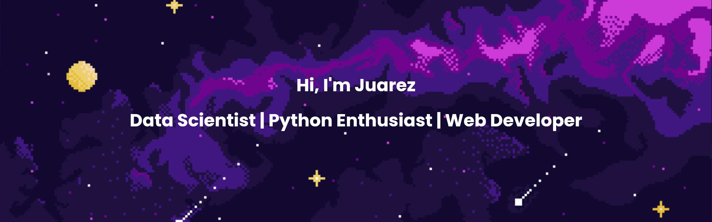

---

Click here to read a brief description about me...
 

My career started in 2013, when I decided to study and understand computers and how we can program them. It all started when I was approved and allowed to study **Systems Analysis** (undergraduate) at the Federal Institute of Rio Grande do Sul (IFRS). During this period, I had the opportunity to expand my theory by working as an intern for several great companies, such as Stefanini, Dell, and CWI. Finally, at the end of my undergraduate course, I got exposed to Artificial Intelligence and did my final project about how games can be a great environment to create experiments with artificial intelligence algorithms.

In 2015 I started my **Master's in Computer Science** at the Pontifical Catholic University of Rio Grande do Sul (PUCRS). Influenced by Artificial Intelligence, I chose the **Machine and Deep Learning** fields. I became a full-grant student in partnership with Hewlett Packard (HP Brazil) to join their project about identifying actions and goals in video sequences. In this project, I had the chance to develop my skills using the Python program language and several deep learning models for classification and action recognition. During this period, I received the **best student paper award at IEEE Joint Conference on Neural Networks** (IJCNN) for a work that uses action recognition to support visually impaired people. Two years later, In 2017, I received a Master's degree in Computer Science for a thesis involving the usage of small datasets with deep learning models. In addition, I was **rewarded with the second-best Master's thesis in Artificial Intelligence by CTDIAC** at the Brazilian Conference on Intelligent Systems.

**In 2018 at PUCRS, I started my Ph.D.** focusing on the research on self-supervised imitation learning using deep neural networks and agents theory. In the second year of my Ph.D. I was approved in the CAPES-PrInt program to become an **exchange student in partnership with the University of Aberdeen** (UoA) in Aberdeen, Scotland. In addition, I joined the industry as a **Machine Learning Engineer** acting in the computer vision field and later as a **Data Scientist** for Sicredi Bank, where I work today, using Reinforcement and Machine Learning to create and maintain recommendation systems.

_I expect to finish my Ph.D. in the first semester of 2023 with a thesis about self-supervised imitation learning._

For a complete curriculum, check out my [LinkedIn](https://www.linkedin.com/in/juarez-monteiro/). <!--For a brief description, check out my [CV](data/cv.pdf)-->

---

### Check out my latest projects 🤓

Click here to read more...

       

        **[HAPRec: Hybrid Activity and Plan Recognizer](https://youtu.be/eb_6I6dzrEE)** 

        **[IJCNN 2020: Augmented Behavioral Cloning from Observation](https://youtu.be/jlTUoxX_fiw)** 

      

---

  

  
  

&nbsp;&nbsp;
&nbsp;&nbsp;
<!--&nbsp;&nbsp;-->
&nbsp;&nbsp;
<!--&nbsp;&nbsp;-->
&nbsp;&nbsp;
<!---->
<!---->

